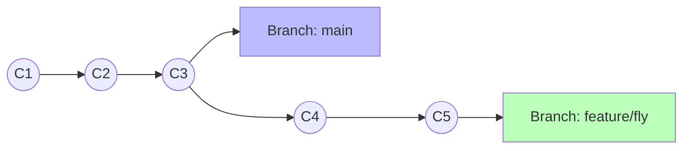
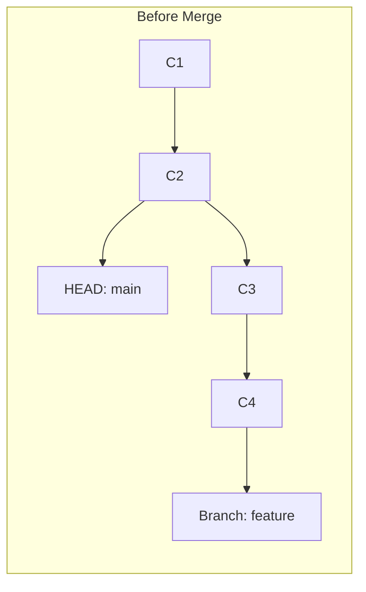
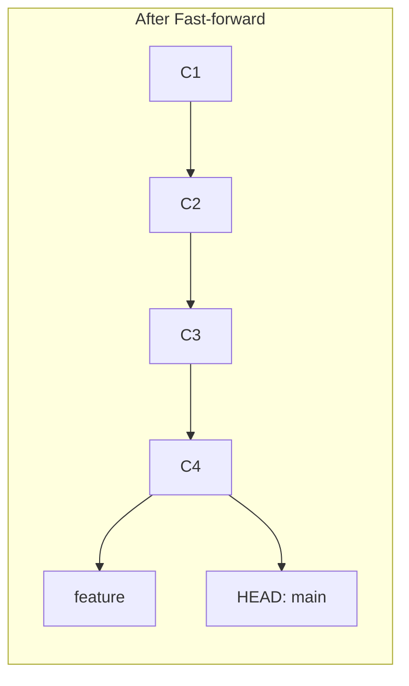
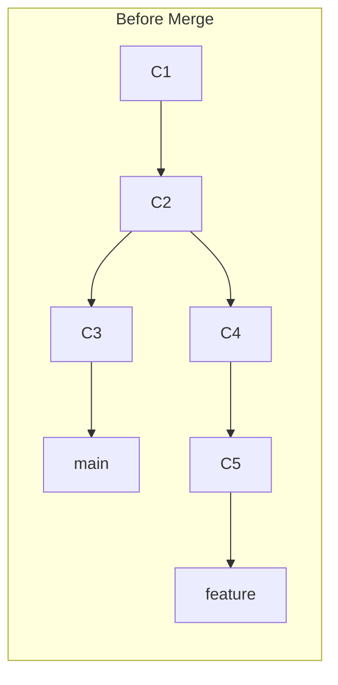
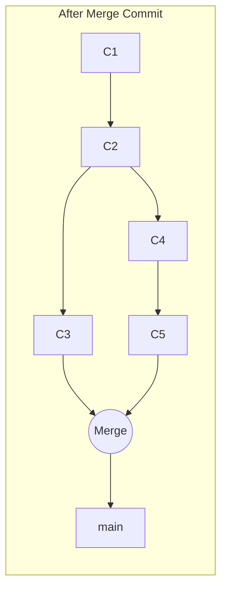

# 第 5 章：分支管理

## 5.1 為什麼需要分支 (Branch)？

分支是 Git 最強大的功能之一。想像你正在開發一個遊戲，遊戲目前運作正常 (Main 分支)。

*   **情境 A**：你想嘗試一個超酷的新功能 (比如讓角色會飛)，但不確定能不能寫出來，或是寫的過程中會不會把遊戲搞壞。
*   **情境 B**：老闆突然說遊戲有個重大 Bug 要馬上修，但你的「飛行功能」才寫到一半，程式碼亂七八糟不能發佈。

我們開了一個 `feature/fly` 分支。在那裡，原本的遊戲被你改得面目全非，但在 `main` 這個主時空裡，遊戲依然是穩定的。

---

## 5.2 分支基本操作

### 1. 建立與切換
*   `git branch <name>`: 建立。
*   `git checkout <name>`: 切換。
*   **`git checkout -b <name>`**: 建立並切換 (常用)。

### 2. 刪除分支
*   `git branch -d <name>` (安全刪除：需已合併)
*   `git branch -D <name>` (強制刪除：不管有無合併，直接砍)

---

## 5.3 合併分支 (Merge) 的兩種模式

當我們想把 `feature` 合併回 `main` 時，Git 會根據兩者的歷史關係決定合併策略。

### 1. Fast-forward (快轉模式)
**條件**：`main` 在你切出去開發後，**完全沒有任何新的 Commit**。
**行為**：Git 為了省事，直接把 `main` 的指標「拿起來」，往前貼到 `feature` 最新的位置。

**(執行 `git merge feature` 後)**

*   **特徵**：歷史線是直的。

### 2. Merge Commit (非快轉模式 / 3-Way Merge)
**條件**：`main` 在你開發期間也有了新的 Commit (原本的基準點已經不同了)。
**行為**：Git 必須產生一個全新的 Commit (Merge Commit) 來綁定這兩個分岔的歷史。

**(執行 `git merge feature` 後)**

*   **特徵**：歷史線有分岔再匯合的菱形結構。
*   **指令**：`git merge --no-ff feature` (強制使用此模式，即使可以快轉)。這在團隊協作中很常見，為了保留「曾經有過這個分支」的歷史證據。
