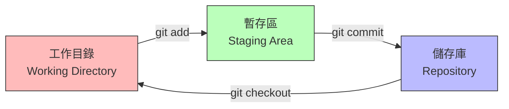
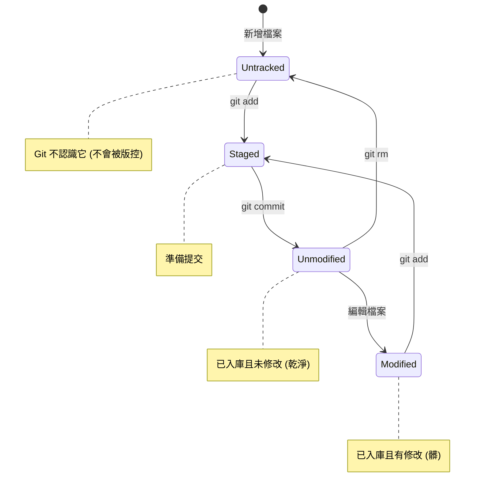

# 第 3 章：建立與管理專案 (Repository)

## 3.1 建立 Git 專案 (Project Initialization)

要讓一個普通的資料夾變成 Git 可以管理的專案，我們需要進行「初始化」的動作。

### 指令：`git init`

1.  開啟終端機，移動到你想建立專案的目錄 (或建立新目錄)：
    ```bash
    mkdir my-first-git-project
    cd my-first-git-project
    ```
2.  輸入初始化指令：
    ```bash
    git init
    ```
3.  你會看到類似這樣的訊息：`Initialized empty Git repository in /path/to/.git/`。

### 幕後直擊：`.git` 資料夾
Git 的所有魔法都藏在一個隱藏的 `.git` 資料夾裡。
*   `config`: 專案層級的設定檔。
*   `objects/`: 這就是 Git 的「資料庫」。所有檔案的內容、Commit 資訊都經過壓縮與 Hash 運算後存在這裡。
*   `HEAD`: 一個文字檔，記錄著「你現在在哪裡」(通常是指向某個分支)。

---

## 3.2 Git 的三大區域 (The Three States)

這是 Git 最核心、也是新手最容易搞混的觀念。透過下圖，我們可以清楚看到資料是如何流動的。



1.  **工作目錄 (Working Directory)**：你平常編輯檔案的地方 (檔案總管看得到)。
2.  **暫存區 (Staging Area / Index)**：一層透明的薄膜，記錄著「下一次 Commit 要包含什麼」。
3.  **儲存庫 (Repository / Local Repo)**：永久儲存的歷史紀錄資料庫。

---

## 3.3 檔案的生命週期 (The Lifecycle)

除了三大區域，檔案本身也有狀態的變化。



*   **Untracked (未追蹤)**：新建立的檔案，Git 還沒把它列入管轄。
*   **Unmodified (未修改)**：檔案已存在 Git 裡，且內容跟最後一次 Commit 一模一樣。
*   **Modified (已修改)**：檔案已存在 Git 裡，但內容被你改過了。
*   **Staged (已暫存)**：你把 Modified 或 Untracked 的檔案 `git add` 了，準備存檔。

---

## 3.4 基本工作流程：Add 與 Commit

### 1. 檢查狀態 `git status`
這絕對是你最常用的指令。
*   **紅色**：Modified 但還沒 Add。
*   **綠色**：Staged，準備 Commit。

```bash
git status
```

### 2. 新增檔案到暫存區 `git add`
```bash
git add index.html
```
*   `git add .`：把當前目錄下**所有**變更 (包含新增、修改、刪除) 都加入暫存區。這是最常用的指令，但要小心別把垃圾檔也加進去了 (記得設 `.gitignore`)。
*   `git add -p` (Patch mode)：進階技巧。Git 會一段一段程式碼問你「這段要不要加？」，適合用在一個檔案改了很多功能，但只想分批提交時。

### 3. 提交變更 `git commit`
```bash
git commit -m "Create initial homepage"
```
*   **Commit Message 規範**：好的訊息應該像是 `Type: Subject`。
    *   `feat: add login page` (新增功能)
    *   `fix: resolve null pointer exception` (修 Bug)
    *   `docs: update readme` (改文件)
    *   `style: format code` (排版)

### 小測驗：
如果你修改了檔案，但忘了執行 `git add` 就直接執行 `git commit`，會發生什麼事？
*   **答案**：什麼事都不會發生 (或只會 Commit 之前已經 Add 過的檔案)。因為 Git **只會提交暫存區 (Staging Area) 裡的東西**。這就是 Git 與 SVN 最大的不同之一。
