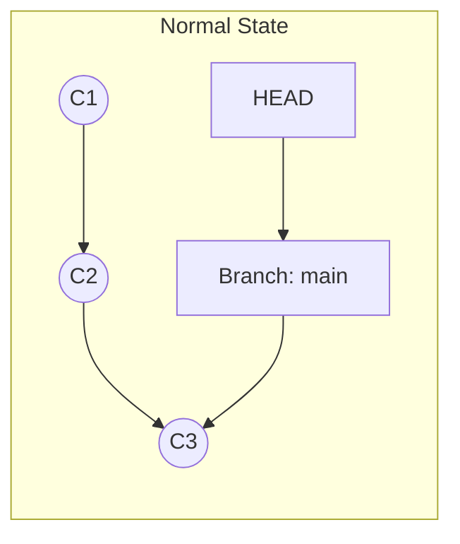
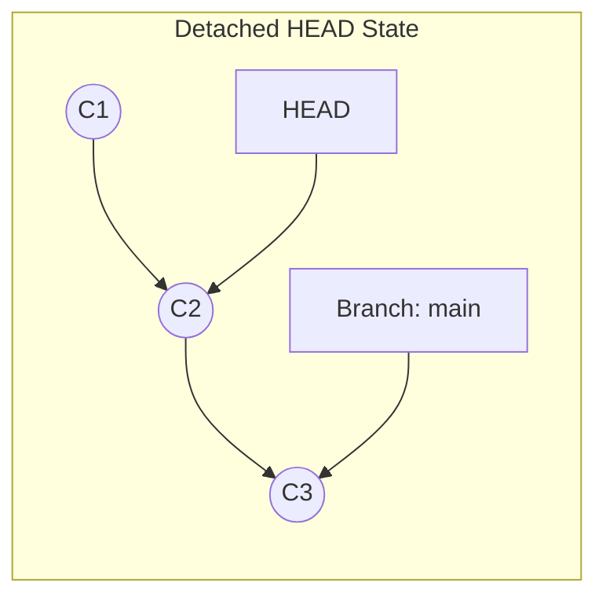

# 第 4 章：時光機操作

## 4.1 檢視歷史紀錄：`git log`

當我們累積了幾個 Commit 後，就需要回頭看看我們到底做了什麼。

### 基本指令
```bash
git log
```
這會顯示詳細的歷史紀錄。

### 強大的格式化 (`--pretty=format`)
預設的 log 資訊太多，我們常用自訂格式來顯示。

| 參數 | 說明 |
| :--- | :--- |
| `%H` | 完整的 Commit Hash (40 chars) |
| `%h` | 簡短的 Commit Hash (7 chars) |
| `%an` | 作者名字 (Author Name) |
| `%ar` | 修訂日期 (相對時間, e.g., 2 days ago) |
| `%s` | 提交訊息標題 (Subject) |

**推薦的 Alias 設定 (再次提醒)**：
```bash
git config --global alias.lg "log --color --graph --pretty=format:'%Cred%h%Creset -%C(yellow)%d%Creset %s %Cgreen(%cr) %C(bold blue)<%an>%Creset' --abbrev-commit"
```

---

## 4.2 比較差異：`git diff`

在 Commit 之前，我們通常想知道「我到底改了什麼 code？」。這裡有三種比較的維度：

```mermaid
graph TD
    WD[工作目錄 (Working Dir)]
    Stage[暫存區 (Staging)]
    Repo[儲存庫 (Repo/HEAD)]
    
    WD <-->|git diff| Stage
    Stage <-->|git diff --cached| Repo
    WD <-->|git diff HEAD| Repo
    
    style WD fill:#fbb
    style Stage fill:#bfb
    style Repo fill:#bbf
```

1.  **`git diff`**：比較 **工作目錄 vs 暫存區**。
    *   *用途*：看我還有哪些改動還沒 `add` 進去。
2.  **`git diff --cached`** (或 `--staged`)：比較 **暫存區 vs HEAD**。
    *   *用途*：看我已經 `add` 了什麼，也就是「如果我現在 commit，會提交什麼內容」。
3.  **`git diff HEAD`**：比較 **工作目錄 vs HEAD**。
    *   *用途*：不管有沒有 add，看我跟上一次 commit 總共差了多少。

---

## 4.3 時光穿梭：`git checkout` 與 HEAD

### 什麼是 HEAD？
HEAD 是一個指標 (Pointer)，它指向「你現在所在的 Commit」。
通常 HEAD 會指向所有的分支 (Branch)，而分支再指向 Commit。



### Detached HEAD (斷頭狀態)
當你 Check out 到某個舊的 Commit ID (而不是分支名) 時，Git 會有一個恐怖的警告：
`You are in 'detached HEAD' state.`

這代表 **HEAD 直接指向了 Commit，而不是分支**。



**用途**：
1.  **考古**：查看舊版本的程式碼運作狀況。
2.  **實驗**：在這裡亂改亂玩，如果不滿意，切回 `main` 這些實驗就會被丟棄 (因為沒有分支指著它們，Git 的垃圾回收機制 GC 稍後會把這些懸空 Commit 清掉)。

### 相對位置參照 (Relative Refs)
除了用 Commit hash (`f2a3c9`)，我們常用相對位置來移動。

*   **`~` (Tilde)**：往上 (祖先) 移動。
    *   `HEAD~1`：HEAD 的前一個版本 (爸爸)。
    *   `HEAD~2`：HEAD 的前兩個版本 (爺爺)。
*   **`^` (Caret)**：往上移動 (針對 Merge Commit 的多個父節點)。
    *   `HEAD^`：等同於 `HEAD~1`。
    *   `HEAD^2`：Merge Commit 的第二個父節點 (通常是 merge 進來的那條分支)。

**範例**：
退回上個版本看一眼：
```bash
git checkout HEAD~1
```
