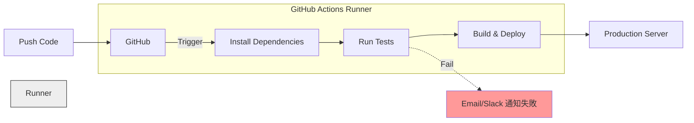

# 第 10 章：自動化與網站託管

GitHub 不只存放程式碼，還能免費幫你架網站跟跑測試！

## 10.1 GitHub Actions：CI/CD 自動化流程

**GitHub Actions** 是 GitHub 內建的自動化工具 (CI/CD)。
它可以幫你在「特定事件發生時」(例如有人 Push code)，自動執行一系列指令。

### 什麼是 CI/CD？
*   **CI (Continuous Integration)**：持續整合。每次 push 都自動跑測試，確保新程式碼沒有弄壞舊功能。
*   **CD (Continuous Deployment)**：持續部署。測試通過後，自動把程式碼推到伺服器 (AWS/Heroku)。



### 實戰：Hello World Workflow
Workflow 定義檔必須放在 `.github/workflows/` 資料夾下，並為 `.yml` 格式。

**`.github/workflows/ci.yml` 範例解析：**

```yaml
name: Node.js CI

# 1. 觸發時機 (Triggers)
on:
  push:
    branches: [ "main" ]    # 當 main 被 push 時
  pull_request:
    branches: [ "main" ]    # 當有 PR 要合併進 main 時

# 2. 任務 (Jobs)
jobs:
  build-and-test:
    runs-on: ubuntu-latest  # 使用 GitHub 提供的 Linux 虛擬機

    steps:
    # 步驟 1: 把程式碼抓下來
    - name: Checkout code
      uses: actions/checkout@v3

    # 步驟 2: 安裝 Node.js 環境
    - name: Setup Node.js
      uses: actions/setup-node@v3
      with:
        node-version: '18'

    # 步驟 3: 安裝依賴並測試
    - name: Install & Test
      run: |
        npm install
        npm test
```

只要把這個檔案 commit 上去，以後每次 push，GitHub 就會自動開一台虛擬機幫你跑這些指令。

---

## 10.2 GitHub Pages：免費的網站空間

如果你寫的是 **靜態網頁** (HTML/CSS/JS, 或 React/Vue 打包後的檔案)，GitHub 提供免費的網頁託管。

### 設定步驟
1.  進入你專案的 **Settings** -> **Pages**。
2.  在 **Build and deployment** 選擇 `Deploy from a branch`。
3.  選擇 `main` 分支跟 `/ (root)` 資料夾。
4.  存檔後，幾分鐘內你會得到 `https://<username>.github.io/<repo>/`。

> **現代化部署 (搭配 Actions)**：
> 現在更流行用 **GitHub Actions** 來自動 Build React/Vue 專案，然後把 `dist/` 產物部署到 Pages。GitHub 官方已有現成的 "Static HTML" 或 "Reac/Vue" workflow template 可直接套用。

---

## 10.3 Dependabot：自動修補漏洞

現代專案依賴龐雜 (npm_modules 黑洞)。當你的依賴套件 (e.g., lodash) 出現安全漏洞時，**Dependabot** 會救你。

**運作原理**：
1.  機器人每天掃描你的 `package.json`。
2.  發現 `lodash` 有漏洞。
3.  自動發一個 Pull Request 給你：`Bump lodash from 4.17.15 to 4.17.19`。
4.  你看一眼 CI 測試綠燈 (沒有改壞東西)，按 Merge。收工。

**開啟方式**：
Settings -> **Code security and analysis** -> Dependabot alerts & security updates (Enable)。
