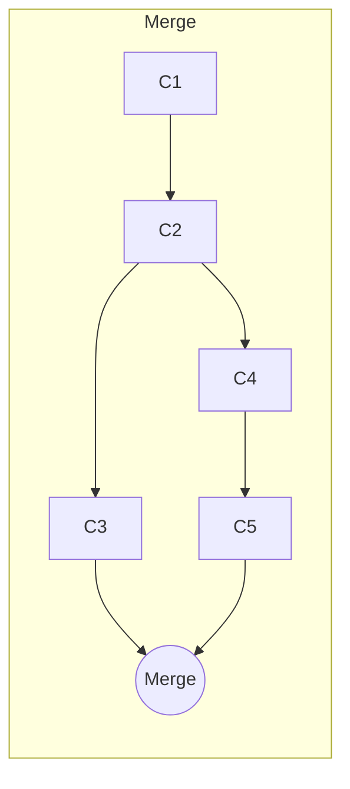
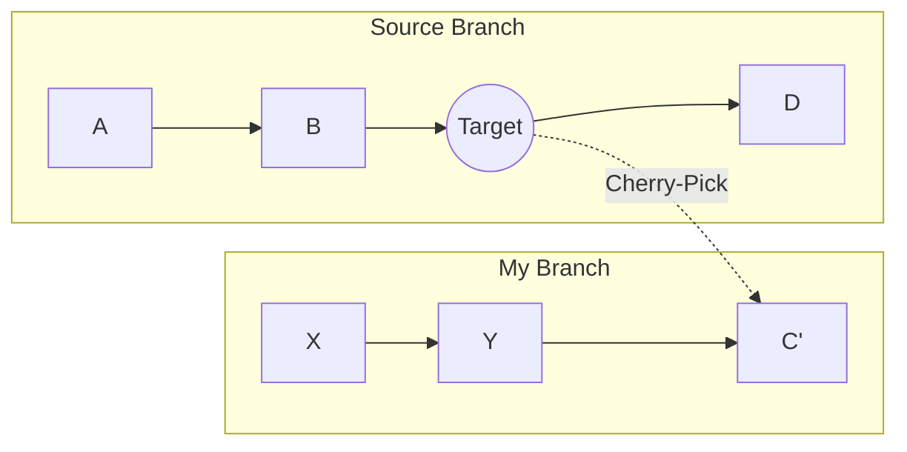

# 第 11 章：進階 Git 指令

掌握了基礎操作後，我們來學習那些能讓你成為 Git 大師 (Git Guru) 的進階指令。

## 11.1 Rebase vs Merge (世紀大對決)

Rebase (變基) 是最容易讓新手混淆的概念。為什麼有 Merge 了還需要 Rebase？

### Merge (合併)
保留完整的歷史真相。

*   **優點**：真實紀錄了「這裡曾經分岔過」。
*   **缺點**：如果太多人同時開發，歷史線會變成像「捷運路線圖」一樣亂。

### Rebase (變基)
重寫歷史，讓線圖變直。
它的原理是：「把你的 Commit 暫時拿起來，把最新的 main 墊在下面，再把你的 Commit 接上去」。

```mermaid
graph LR
    subgraph "After Rebase"
    C1 --> C2 --> C3 --> C4' --> C5'
    
    note right of C5': 看起來像是在 C3 之後才開始開發的
    end
```

```bash
git checkout feature
git rebase main
```

### ⚠️ 黃金準則 (The Golden Rule)
> **絕對不要對已經 Push 出去的公共分支 (Public Branch) 執行 Rebase！**

Rebase 會**修改 Commit ID** (注意上圖的 `C4'` 與 `C5'`)。如果你對大家共用的 `main` 做了 rebase，會導致其他所有人的歷史紀錄跟遠端衝突 (Non-fast-forward)，你會被同事殺掉。

---

## 11.2 Cherry-pick：精準撿屍

有時候你不需要合併整個分支，你只想要某個分支裡的**其中這一個 Commit**。



例如：同事在 `experiment` 分支寫了一個很棒的 Utils 函式 (`C`)，但該分支其他程式碼都爛掉了。你只想把它撿過來：

```bash
git cherry-pick <commit-hash-C>
```

---

## 11.3 Stash：暫存大法

### 情境
你正在修一個 Bug (檔案都在修改中，還沒 Commit)，老闆突然衝進來：「線上系統炸了！快去修 Hotfix！」

你是無法切換分支的，因為你的工作目錄是髒的 (Dirty)。但你又不想提交寫一半的爛 code。

### 解法：Stash (藏匿)
```bash
# 1. 把所有修改 (Modified/Staged) 暫存到剪貼簿
git stash

# 2. 現在工作目錄變乾淨了，可以切換分支
git checkout main
# ...修完 hotfix...

# 3. 回來原本分支，把修改叫回來
git checkout feature
git stash pop
```

> **小技巧**：`git stash list` 可以看你存了幾個版本。`git stash apply` 可以套用但不刪除暫存。

---

## 11.4 Reset vs Revert：後悔的藝術

| 指令 | 作用 | 修改歷史? | 適用情境 |
| :--- | :--- | :--- | :--- |
| **Reset** | 時光倒流 (指標往回移) | **Yes** (危險) | 本機開發做壞了，想重來 |
| **Revert** | 負負得正 (新增反向 Commit) | **No** (安全) | 已經 Push 出去的公共分支 (要留全屍) |

**Reset 圖解** (`git reset --hard HEAD~1`)：
```text
[C1] <- [C2] <- [C3] (HEAD)
       |
    (Reset!)
       v
[C1] <- [C2] (HEAD)   ([C3] 消失了)
```

**Revert 圖解** (`git revert C3`)：
```text
[C1] <- [C2] <- [C3] <- [C4: Revert C3] (HEAD)
```
`C4` 的內容剛好跟 `C3` 相反 (Add 變成 Delete)，效果抵銷，但 `C3` 的歷史還在。
