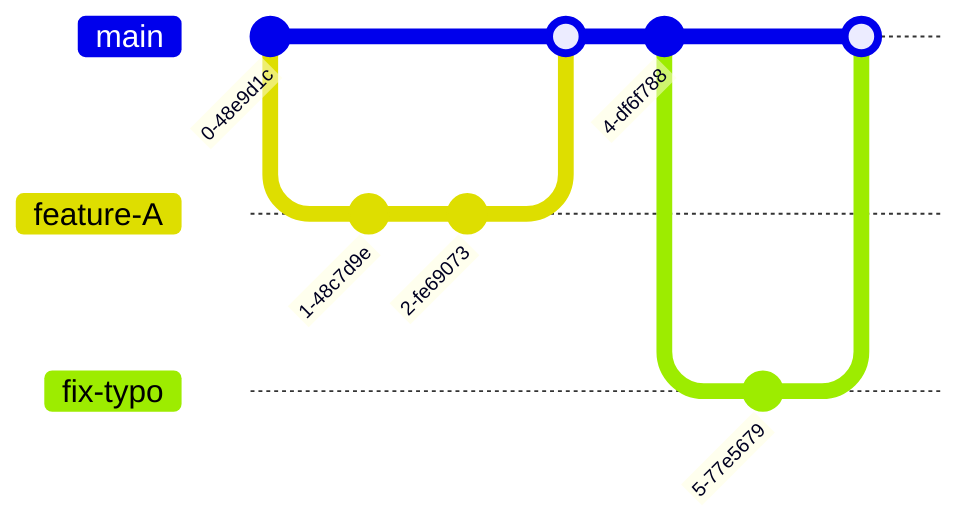

# 第 12 章：團隊開發工作流 (Workflow Models)

學會了指令是一回事，如何與團隊配合又是另一回事。這章介紹幾種業界主流的 Git 工作流。

## 12.1 Git Flow (經典款)

這是最早被廣泛採用的模型，結構嚴謹，適合發軟體版本週期較長 (如 Windows 軟體, 手機 App) 的產品。

### 主要角色
*   **main**: 永遠是穩定的正式版本。
*   **develop**: 開發中的最新版本 (不一定穩定)。
*   **feature/**: 從 develop 分出來開發新功能。
*   **release/**: 準備發佈新版前的緩衝區 (只修 bug 不加功能)。
*   **hotfix/**: 線上版本緊急修復，從 main 直接分出來，修完合併回 main 和 develop。

---

## 12.2 GitHub Flow (現代敏捷款)

GitHub 官方採用的流程，目前最主流的 Web 開發模式，強調 **Deploy Early, Deploy Often**。

### 規則
1.  **main 分支永遠是可以部署的狀態 (Deployable)**。
2.  任何新功能或修復，都從 main 開出一個 **Branch**。
3.  開發完後，發起 **Pull Request (PR)**。
4.  經過 Code Review 和自動化測試後，合併進 main。
5.  一旦合併進 main，就立即 (或盡快) 部署到正式環境。

---

## 12.3 GitLab Flow (多環境款)

GitLab 提出的改良版，特別強調與部署環境 (Environments) 的結合。

*   **main**: 開發主線。
*   **pre-production** (Branch): 預備環境。
*   **production** (Branch): 正式環境。

程式碼是單向流動的：`main` -> `pre-production` -> `production`。
這適合那些「無法隨時部署」的專案 (例如需要經過 QA 人工驗收才能上線的系統)。

---

## 12.4 Trunk Based Development (主幹開發)

Google / Facebook 等巨頭採用的模式。

### 規則
*   **幾乎不開長壽的分支**。
*   所有開發者每天都直接 Commit 到 `main` (Trunk)。
*   利用 **Feature Toggles (功能開關)** 來隱藏尚未完成的功能。

---

## 總結建議

| 團隊類型 | 推薦流程 | 關鍵字 |
| :--- | :--- | :--- |
| **開源專案 / Web 新創** | **GitHub Flow** | 快速、PR Base、CI/CD |
| **傳統軟體 / App** | **Git Flow** | 版本號明確、Release 週期長 |
| **企業內部 / 需 QA 驗收** | **GitLab Flow** | 重視環境部署 (Dev/Stage/Prod) |
| **超強大大神團隊** | **Trunk Based** | 速度極快、依賴強大測試 |
