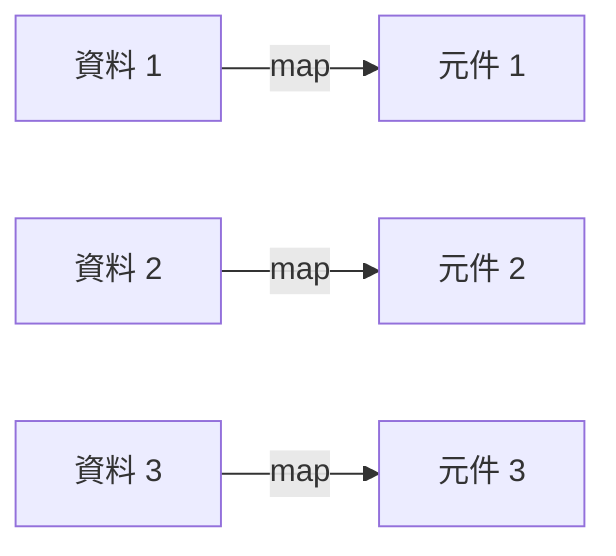
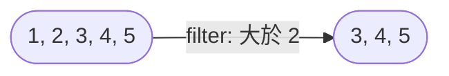

# 2.4 陣列方法三劍客：map, filter, reduce

在 React 中，我們幾乎不使用 `for` 迴圈來渲染列表。相反，我們依賴 JavaScript 強大的陣列方法。這些方法都是**Functional Programming** 的風格：它們不會修改原陣列，而是返回一個新的陣列（或值）。這完全符合 React 的不可變性 (Immutability) 原則。

## 1. `map()`：資料的變身術

`map` 用於將陣列中的「每一個元素」轉換成「新的形式」。

### 概念圖解



### 語法與範例

```javascript
/* 
  map(callback(currentValue, index, array))
  回傳：一個新陣列，長度與原陣列相同
*/

const prices = [100, 200, 300];

// 打九折
const discounted = prices.map(price => price * 0.9);
// [90, 180, 270]
```

### React 實戰：列表渲染

這是 `map` 最重要的用途：將**資料陣列**轉換為**JSX 元素陣列**。

```jsx
const products = [
  { id: 1, name: 'Laptop' },
  { id: 2, name: 'Phone' }
];

function ProductList() {
  return (
    <ul>
      {/* 直接在 JSX 中使用 map */}
      {products.map((product) => (
        <li key={product.id}>
          {product.name}
        </li>
      ))}
    </ul>
  );
}
```

> [!WARNING]
> **Key Prop 是必須的！**
> 在 React 中使用 `map` 產生列表時，必須為每個元素提供一個獨一無二的 `key` prop。這幫助 React 識別哪些項目被改變、新增或移除 (Reconciliation)。

---

## 2. `filter()`：資料的過濾網

`filter` 用於篩選出符合條件的元素。

### 概念圖解



### 語法與範例

```javascript
/*
  filter(callback(currentValue))
  回傳：一個新陣列，包含所有回傳 true 的元素
*/

const scores = [85, 42, 90, 60, 30];

// 及格的分數
const passed = scores.filter(score => score >= 60);
// [85, 90, 60]
```

### React 實戰：刪除項目

在 Redux 或 State 更新中，我們常用 `filter` 來「刪除」某個項目（其實是產生一個不包含該項目的新陣列）。

```javascript
const [todos, setTodos] = useState([
  { id: 1, text: 'Buy milk' },
  { id: 2, text: 'Walk dog' }
]);

const handleDelete = (idToRemove) => {
  // 只保留 id 不等於要刪除 id 的項目
  const newTodos = todos.filter(todo => todo.id !== idToRemove);
  setTodos(newTodos);
};
```

---

## 3. `reduce()`：資料的煉金術

`reduce` 是最強大但也最難懂的方法。它可以將陣列「縮減」為單一值（數字、物件、甚至是另一個陣列）。

### 語法與範例

```javascript
/*
  reduce(callback(accumulator, currentValue), initialValue)
  回傳：單一值 (accumulator 的最終狀態)
*/

const numbers = [10, 20, 30, 40];

const sum = numbers.reduce((total, num) => {
  return total + num;
}, 0); // 0 是初始值

// 過程：
// 1. 0 + 10 = 10
// 2. 10 + 20 = 30
// 3. 30 + 30 = 60
// 4. 60 + 40 = 100
```

### React 實戰：計算購物車總金額

```jsx
const cart = [
  { name: 'Apple', price: 30, qty: 2 },
  { name: 'Banana', price: 20, qty: 3 }
];

const totalPrice = cart.reduce((acc, item) => {
  return acc + (item.price * item.qty);
}, 0);
// 30*2 + 20*3 = 120
```

---

## 4. 三劍客合體技 (Method Chaining)

因為 `map` 和 `filter` 都回傳陣列，我們可以將它們串接 (Chain) 起來。

**場景：找出所有庫存充足的商品，顯示其名稱**

```javascript
const products = [
  { name: 'PS5', stock: 0 },
  { name: 'Switch', stock: 5 },
  { name: 'Xbox', stock: 3 }
];

const availableProductNames = products
  .filter(p => p.stock > 0)    // 1. 先過濾：只剩 Switch, Xbox
  .map(p => p.name);           // 2. 再轉換：['Switch', 'Xbox']
```

## 小結

| 方法 | 用途 | 回傳值 | React 常見用途 |
| :--- | :--- | :--- | :--- |
| **map** | 轉換 | 新陣列 (長度不變) | 渲染 Component 列表 |
| **filter** | 篩選 | 新陣列 (長度 <= 原長度) | 刪除項目、搜尋過濾 |
| **reduce** | 聚合 | 任意值 | 計算總和、轉換資料結構 |
