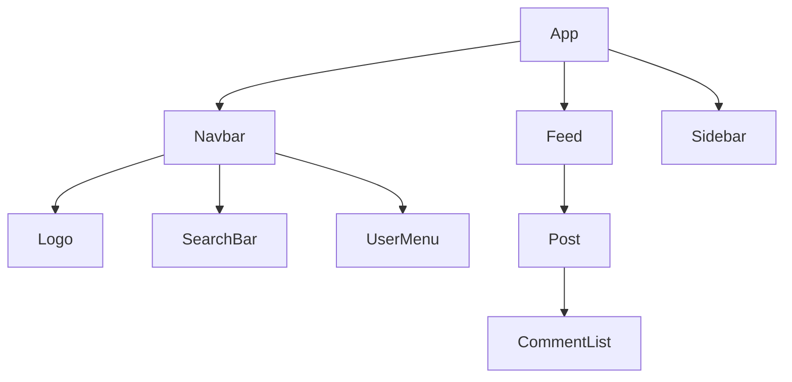

# 3.2 Component 的思維：如何拆解 UI

React 開發的核心就是 **「元件化 (Component-Based)」**。我們不再寫一整頁的 HTML，而是將頁面拆解成一個個獨立、可重用的小積木。

## 1. 元件樹 (Component Tree)

想像我們正在開發 Facebook 的導覽列。

```
<Navbar>
  ├── <Logo />
  ├── <SearchBar>
  │   ├── <Input />
  │   └── <Button>搜尋</Button>
  └── <UserMenu>
      ├── <Avatar />
      └── <Dropdown />
```

這種 **樹狀結構** 是 React 應用程式的骨架。資料 (Props) 由上往下流動，事件由下往上觸發。

### Mermaid 視覺化



## 2. 原子設計 (Atomic Design)

如何決定元件該拆多細？**Atomic Design** 提供了一套很好的分類方法。

### 2.1 Atoms (原子)
不可再分割的最小單位。通常對應 HTML 基本標籤，但加上了樣式。
- **範例**：`Button`, `Input`, `Label`, `Icon`
- **特點**：極度通用的 Dumb Component，只負責展示。

### 2.2 Molecules (分子)
由幾個原子組成的簡單功能群組。
- **範例**：`SearchBar` (Input + Button), `FormGroup` (Label + Input)
- **特點**：開始有一點點 UI 邏輯。

### 2.3 Organisms (組織)
由原子和分子組成的複雜區塊。
- **範例**：`Header` (Logo + Nav + Search), `ProductCard` (Image + Title + Price + BuyBtn)
- **特點**：通常對應頁面上的一個獨立區塊。

### 2.4 Templates (模板) & Pages (頁面)
負責佈局 (Layout) 與資料注入。
- **範例**：`MainLayout`, `HomePage`

---

## 3. UI 拆解實戰：Instagram貼文

假設我們要實作一個 IG 貼文卡片，該怎麼拆？

**由外而內 (Top-Down)**：

1. **`PostCard`** (Container)
   - 包含 Header, Image, Actions, Caption

2. **`PostHeader`**
   - 包含 `<Avatar />` (Atom)
   - 包含 `<Username />` (Atom)

3. **`PostControlBar`**
   - 包含 Like, Comment, Share 按鈕 (Atoms)

4. **`CommentList`**
   - 包含多個 `<CommentItem />`

### 程式碼結構示意

```jsx
function PostCard({ post }) {
  return (
    <article className="border rounded-lg">
      <PostHeader user={post.user} />
      
      <PostControlBar />
      <div className="p-4">
        <p>{post.caption}</p>
        <CommentList comments={post.comments} />
      </div>
    </article>
  );
}
```

## 4. 拆分的原則

### 4.1 單一職責原則 (Single Responsibility Principle)
一個元件應該**只做一件事**。如果一個元件同時負責「顯示 User 資料」又負責「顯示商品列表」，那就該拆開。

### 4.2 DRY (Don't Repeat Yourself)
如果你發現自己在複製貼上同一段 JSX 程式碼（例如三個地方都有同樣的 Button 樣式），那就該把它抽成一個元件。

### 4.3 何時不要拆？
不要為了拆而拆。如果一個部分只用一次，且程式碼不長（例如 < 100 行），那麼寫在同一個檔案裡完全沒問題。過度拆分會導致 **Prop Drilling** (資料要傳遞太多層)，反而增加維護難度。

## 小結

- **Component Tree** 幫助我們理解結構。
- **Atomic Design** 幫助我們建立可維護的元件系統。
- 拆分是藝術：太粗會變成巨型元件 (Monolith)，太細會變成碎片地獄。保持平衡！
